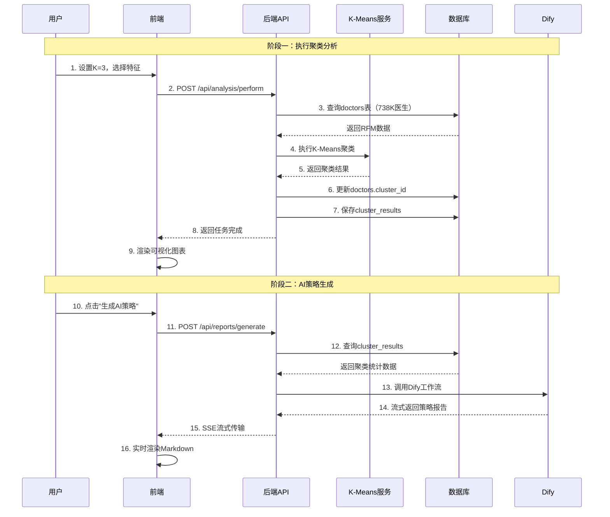

# 医药市场智能分析系统 - 聚类分析模块完整开发文档

> **模块**: 核心分析引擎 - K-Means聚类 + AI策略生成
> **当前状态**: 前端UI框架完成，后端API待开发
> **开发优先级**: ⭐⭐⭐⭐⭐ (最高优先级)

---

## 📋 目录

1. [系统架构回顾](#1-系统架构回顾)
2. [模块功能设计](#2-模块功能设计)
3. [数据库设计](#3-数据库设计)
4. [后端开发详解](#4-后端开发详解)
5. [前端开发详解](#5-前端开发详解)
6. [Dify集成方案](#6-dify集成方案)
7. [测试方案](#7-测试方案)
8. [部署清单](#8-部署清单)

---

## 1. 系统架构回顾

### 1.1 核心三层架构

```
┌─────────────────────────────────────────────────────┐
│          前端 Vue3 (已完成UI框架)                    │
│  ┌────────────┬────────────┬────────────────────┐  │
│  │ 配置面板   │ 结果展示区 │ AI报告生成        │  │
│  │ - K值滑块  │ - 3D散点图 │ - 对话式界面      │  │
│  │ - 特征选择 │ - 雷达图   │ - Markdown渲染    │  │
│  │ - 开始分析 │ - 统计表   │ - 流式输出        │  │
│  └────────────┴────────────┴────────────────────┘  │
└─────────────────────────────────────────────────────┘
                         ↕ HTTP REST API
┌─────────────────────────────────────────────────────┐
│          后端 FastAPI (本次开发重点)                 │
│  ┌────────────┬────────────┬────────────────────┐  │
│  │ 分析服务   │ 数据处理   │ AI集成服务        │  │
│  │ analysis_  │ data_      │ dify_             │  │
│  │ service.py │ processor  │ service.py        │  │
│  └────────────┴────────────┴────────────────────┘  │
└─────────────────────────────────────────────────────┘
                         ↕
┌─────────────────────────────────────────────────────┐
│    数据层 & AI层 (SQLite + Scikit-Learn + Dify)     │
│  ┌──────────┬──────────┬──────────┬─────────────┐  │
│  │ doctors  │ cluster_ │ analysis_│ ai_reports  │  │
│  │ (738K)   │ results  │ tasks    │             │  │
│  └──────────┴──────────┴──────────┴─────────────┘  │
│                                                     │
│  K-Means算法 ────────┐  ┌───── Dify智能体         │
│  (Scikit-Learn)      └──┘     (LLM策略生成)        │
└─────────────────────────────────────────────────────┘
```

### 1.2 核心业务流程



### 1.3 关键数据流

```
原始数据（doctors表）
  738,772名医生
  ↓ [查询]
RFM特征矩阵
  (738772 × 2) → [Frequency, Monetary]
  ↓ [标准化]
标准化数据
  StandardScaler: mean=0, std=1
  ↓ [K-Means聚类]
聚类标签
  每个医生 → cluster_id (0, 1, 2)
  ↓ [统计计算]
聚类中心特征
  {
    "cluster_0": {avg_F: 50, avg_M: 10000},
    "cluster_1": {avg_F: 15, avg_M: 3000},
    "cluster_2": {avg_F: 3, avg_M: 200}
  }
  ↓ [传递给Dify]
AI策略报告
  "针对cluster_0高价值客户，建议..."
```

---

## 2. 模块功能设计

### 2.1 核心功能清单

```
聚类分析模块
├── 2.1 配置与执行
│   ├── K值选择（2-10）
│   ├── 特征选择（R/F/M）
│   ├── 算法选择（当前仅K-Means，未来扩展）
│   ├── 任务命名
│   └── 开始分析按钮
│
├── 2.2 分析过程
│   ├── 数据加载（738K医生）
│   ├── 数据预处理（缺失值、异常值）
│   ├── 特征工程（标准化）
│   ├── K-Means训练
│   ├── 评估指标计算（轮廓系数、惯性）
│   └── 结果持久化
│
├── 2.3 结果展示
│   ├── 聚类评估指标卡片
│   │   ├── 轮廓系数 (Silhouette Score)
│   │   └── 惯性 (Inertia)
│   ├── 可视化图表
│   │   ├── 3D散点图（交互式旋转）
│   │   ├── 雷达图（特征对比）
│   │   └── 箱线图（金额分布）
│   └── 统计表格
│       ├── 各聚类规模
│       ├── 平均RFM值
│       └── 业务标签
│
├── 2.4 AI策略生成
│   ├── 选择目标聚类
│   ├── 自定义Prompt
│   ├── 调用Dify工作流
│   ├── 流式接收报告
│   └── Markdown渲染
│
└── 2.5 历史管理
    ├── 查看历史分析
    ├── 对比不同K值结果
    ├── 导出分析报告
    └── 删除历史记录
```

### 2.2 用户交互流程

**场景1：首次使用**

```
1. 用户进入"聚类分析"页面
2. 看到空状态："请配置参数并开始分析"
3. 左侧配置面板：
   - K值滑块默认为3
   - 特征默认选中 F + M
4. 点击"开始分析"按钮
5. 显示进度条（模拟进度0→100%）
6. 15秒后完成（实际计算约10秒）
7. 右侧展示结果：
   - 顶部：评估指标卡片
   - Tabs切换：散点图/雷达图/统计表
8. 底部：[生成AI策略] [导出报告] 按钮
```

**场景2：调整参数重新分析**

```
1. 用户修改K=4
2. 点击"开始分析"
3. 弹出确认："是否覆盖当前结果？"
4. 确认后重新分析
5. 更新所有图表
6. 提示："分析完成，共发现4个客户群"
```

**场景3：生成AI策略**

```
1. 用户点击"生成AI策略"
2. 打开对话框：
   - 选择目标聚类（下拉框）
   - 输入自定义需求（可选）
3. 点击"开始生成"
4. 显示打字机效果的流式输出
5. 完成后显示[保存] [导出PDF] 按钮
```

### 2.3 错误处理

```
可能的错误情况：

1. 数据不足
   - 检查：doctors表至少100条记录
   - 提示："医生数据不足，请先导入数据"

2. K值不合理
   - 检查：K必须 < doctors数量
   - 提示："K值过大，当前数据仅支持K≤10"

3. 特征缺失
   - 检查：至少选择一个特征
   - 提示："请至少选择一个分析特征"

4. 算法超时
   - 设置：最大执行时间120秒
   - 提示："分析超时，请减少K值或数据量"

5. Dify调用失败
   - 检查：API Key有效性
   - 提示："AI服务暂时不可用，请稍后重试"
```

---

## 3. 数据库设计

### 3.1 核心表结构

#### 表1: doctors (已存在，需扩展)

```sql
-- 扩展字段
ALTER TABLE doctors ADD COLUMN cluster_id INTEGER;
ALTER TABLE doctors ADD COLUMN cluster_label VARCHAR(50);
ALTER TABLE doctors ADD COLUMN updated_at DATETIME DEFAULT CURRENT_TIMESTAMP;

-- 创建索引
CREATE INDEX idx_doctors_cluster ON doctors(cluster_id);
CREATE INDEX idx_doctors_updated ON doctors(updated_at);

-- 示例数据
/*
npi           | cluster_id | cluster_label | rfm_frequency | rfm_monetary
1821157041    | 0          | 顶级客户      | 493           | 91082706.03
1366487498    | 0          | 顶级客户      | 3             | 26746052.32
1336242116    | 1          | 潜力客户      | 7             | 25000341.97
...
*/
```

#### 表2: analysis_tasks (分析任务记录)

```sql
CREATE TABLE analysis_tasks (
    task_id INTEGER PRIMARY KEY AUTOINCREMENT,
    task_name VARCHAR(200) NOT NULL,
    task_type VARCHAR(50) DEFAULT 'clustering',  -- 'clustering', 'rfm_analysis'
  
    -- 任务参数（JSON）
    parameters TEXT,  -- {"k": 3, "features": ["rfm_frequency", "rfm_monetary"]}
  
    -- 任务状态
    status VARCHAR(20) DEFAULT 'pending',  -- pending/running/completed/failed
    progress INTEGER DEFAULT 0,  -- 0-100
  
    -- 执行信息
    created_by INTEGER,  -- 用户ID
    started_at DATETIME,
    completed_at DATETIME,
    execution_time REAL,  -- 秒
    error_message TEXT,
  
    -- 结果关联
    result_id INTEGER,
  
    created_at DATETIME DEFAULT CURRENT_TIMESTAMP,
  
    FOREIGN KEY (created_by) REFERENCES users(id),
    FOREIGN KEY (result_id) REFERENCES cluster_results(cluster_id)
);

-- 索引
CREATE INDEX idx_tasks_status ON analysis_tasks(status);
CREATE INDEX idx_tasks_created_by ON analysis_tasks(created_by);
CREATE INDEX idx_tasks_created_at ON analysis_tasks(created_at DESC);

-- 示例数据
/*
task_id | task_name           | status    | progress | result_id
1       | 2024Q4医生分群     | completed | 100      | 1
2       | 高价值客户筛选     | completed | 100      | 2
3       | K值对比分析        | running   | 45       | NULL
*/
```

#### 表3: cluster_results (聚类结果)

```sql
CREATE TABLE cluster_results (
    cluster_id INTEGER PRIMARY KEY AUTOINCREMENT,
    task_id INTEGER,
  
    -- 聚类配置
    k_value INTEGER NOT NULL,
    algorithm VARCHAR(50) DEFAULT 'k-means',
    features_used TEXT,  -- JSON: ["rfm_frequency", "rfm_monetary"]
  
    -- 聚类统计（JSON）
    cluster_stats TEXT,
    /* 格式示例：
    {
      "0": {
        "size": 200000,
        "size_percentage": 27.1,
        "avg_frequency": 50.2,
        "avg_monetary": 12000.5,
        "median_frequency": 30,
        "median_monetary": 5000,
        "std_monetary": 8000,
        "label": "顶级客户",
        "characteristics": ["高价值", "高活跃"]
      },
      "1": {...},
      "2": {...}
    }
    */
  
    -- 业务标签（JSON）
    cluster_labels TEXT,  -- {"0": "顶级客户", "1": "潜力客户", "2": "大众客户"}
  
    -- 模型评估
    silhouette_score REAL,  -- 轮廓系数 [-1, 1]，越接近1越好
    inertia REAL,           -- 惯性（簇内平方和）
    davies_bouldin_score REAL,  -- DB指数，越小越好（可选）
  
    -- 可视化数据（JSON，采样后的数据）
    visualization_data TEXT,
    /* 格式示例：
    {
      "scatter_data": [
        {"frequency": 50, "monetary": 12000, "cluster": 0, "npi": "1234567890"},
        ...采样1000个点
      ],
      "cluster_centers": [[50.2, 12000.5], [15.3, 3000.1], [3.2, 200.8]],
      "radar_data": [
        {
          "cluster": "0",
          "label": "顶级客户",
          "normalized_frequency": 0.95,
          "normalized_monetary": 0.98
        },
        ...
      ]
    }
    */
  
    created_at DATETIME DEFAULT CURRENT_TIMESTAMP,
    is_active BOOLEAN DEFAULT 1,
  
    FOREIGN KEY (task_id) REFERENCES analysis_tasks(task_id)
);

-- 索引
CREATE INDEX idx_clusters_task ON cluster_results(task_id);
CREATE INDEX idx_clusters_active ON cluster_results(is_active);
CREATE INDEX idx_clusters_created ON cluster_results(created_at DESC);
```

#### 表4: ai_reports (AI策略报告)

```sql
CREATE TABLE ai_reports (
    report_id INTEGER PRIMARY KEY AUTOINCREMENT,
    report_title VARCHAR(300) NOT NULL,
    report_type VARCHAR(50) DEFAULT 'cluster_strategy',
  
    -- 关联数据
    related_cluster_id INTEGER,
    related_cluster_label VARCHAR(50),
  
    -- 报告内容
    report_content TEXT NOT NULL,  -- Markdown格式
    report_summary TEXT,  -- 摘要（前300字）
  
    -- 生成信息
    generated_by INTEGER,
    user_prompt TEXT,  -- 用户自定义的Prompt
    dify_conversation_id VARCHAR(100),
    generation_time REAL,  -- 生成耗时（秒）
  
    -- 统计
    status VARCHAR(20) DEFAULT 'published',  -- draft/published/archived
    view_count INTEGER DEFAULT 0,
  
    created_at DATETIME DEFAULT CURRENT_TIMESTAMP,
    updated_at DATETIME DEFAULT CURRENT_TIMESTAMP,
  
    FOREIGN KEY (generated_by) REFERENCES users(id),
    FOREIGN KEY (related_cluster_id) REFERENCES cluster_results(cluster_id)
);

-- 索引
CREATE INDEX idx_reports_cluster ON ai_reports(related_cluster_id);
CREATE INDEX idx_reports_user ON ai_reports(generated_by);
CREATE INDEX idx_reports_created ON ai_reports(created_at DESC);
```

### 3.2 数据库初始化脚本

```python
# backend/scripts/init_clustering_tables.py
from sqlalchemy import create_engine, text
from app.database import Base, engine
from app.models import AnalysisTask, ClusterResult, AIReport

def init_tables():
    """初始化聚类分析相关表"""
    print("Creating clustering analysis tables...")
  
    # 创建所有表
    Base.metadata.create_all(bind=engine)
  
    # 扩展doctors表
    with engine.connect() as conn:
        # 检查列是否存在
        result = conn.execute(text("PRAGMA table_info(doctors)"))
        columns = [row[1] for row in result.fetchall()]
    
        if 'cluster_id' not in columns:
            conn.execute(text("ALTER TABLE doctors ADD COLUMN cluster_id INTEGER"))
            print("✓ Added cluster_id to doctors table")
    
        if 'cluster_label' not in columns:
            conn.execute(text("ALTER TABLE doctors ADD COLUMN cluster_label VARCHAR(50)"))
            print("✓ Added cluster_label to doctors table")
    
        # 创建索引
        conn.execute(text("CREATE INDEX IF NOT EXISTS idx_doctors_cluster ON doctors(cluster_id)"))
        print("✓ Created index on cluster_id")
    
        conn.commit()
  
    print("✅ All clustering tables initialized successfully!")

if __name__ == "__main__":
    init_tables()
```

---

## 4. 后端开发详解

### 4.1 核心服务：analysis_service.py

```python
# backend/app/services/analysis_service.py
import pandas as pd
import numpy as np
from sklearn.cluster import KMeans
from sklearn.preprocessing import StandardScaler
from sklearn.metrics import silhouette_score, davies_bouldin_score
from sqlalchemy.orm import Session
from datetime import datetime
import json
import logging

from app.models import Doctor, ClusterResult, AnalysisTask
from app.core.exceptions import AnalysisException

logger = logging.getLogger(__name__)

class AnalysisService:
    """聚类分析服务类"""
  
    def __init__(self, db: Session):
        self.db = db
        self.scaler = StandardScaler()
  
    def perform_clustering(
        self,
        k: int,
        features: list[str] = None,
        task_name: str = "K-Means聚类分析",
        user_id: int = None
    ) -> ClusterResult:
        """
        执行K-Means聚类分析
    
        Args:
            k: 聚类数量 (2-10)
            features: 特征列表，默认 ['rfm_frequency', 'rfm_monetary']
            task_name: 任务名称
            user_id: 创建任务的用户ID
    
        Returns:
            ClusterResult对象
    
        Raises:
            AnalysisException: 分析过程中的错误
        """
        start_time = datetime.utcnow()
    
        try:
            # 1. 创建任务记录
            task = self._create_task(k, features, task_name, user_id)
        
            # 2. 验证参数
            self._validate_parameters(k, features)
        
            # 3. 加载数据
            logger.info(f"Loading data for task {task.task_id}...")
            df = self._load_data()
        
            if len(df) < k:
                raise AnalysisException(f"数据量不足：需要至少{k}条记录，当前仅{len(df)}条")
        
            # 4. 数据预处理
            logger.info("Preprocessing data...")
            X, feature_names = self._preprocess_data(df, features)
        
            # 5. 执行聚类
            logger.info(f"Performing K-Means clustering with k={k}...")
            task.status = 'running'
            task.progress = 30
            self.db.commit()
        
            kmeans, labels = self._fit_kmeans(X, k)
            df['cluster'] = labels
        
            # 6. 计算评估指标
            logger.info("Calculating evaluation metrics...")
            task.progress = 60
            self.db.commit()
        
            metrics = self._calculate_metrics(X, labels)
        
            # 7. 计算聚类统计
            logger.info("Computing cluster statistics...")
            task.progress = 80
            self.db.commit()
        
            cluster_stats = self._compute_cluster_stats(df, k, feature_names)
        
            # 8. 生成业务标签
            cluster_labels = self._generate_business_labels(cluster_stats)
        
            # 9. 准备可视化数据
            logger.info("Preparing visualization data...")
            viz_data = self._prepare_visualization_data(df, kmeans, k)
        
            # 10. 更新doctors表
            logger.info("Updating doctors table...")
            self._update_doctors_table(df, cluster_labels)
        
            # 11. 保存聚类结果
            result = ClusterResult(
                task_id=task.task_id,
                k_value=k,
                algorithm='k-means',
                features_used=json.dumps(feature_names),
                cluster_stats=json.dumps(cluster_stats),
                cluster_labels=json.dumps(cluster_labels),
                silhouette_score=float(metrics['silhouette']),
                inertia=float(metrics['inertia']),
                davies_bouldin_score=float(metrics.get('davies_bouldin', 0)),
                visualization_data=json.dumps(viz_data),
                is_active=True,
                created_at=datetime.utcnow()
            )
        
            self.db.add(result)
            self.db.commit()
            self.db.refresh(result)
        
            # 12. 更新任务状态
            execution_time = (datetime.utcnow() - start_time).total_seconds()
            task.status = 'completed'
            task.progress = 100
            task.result_id = result.cluster_id
            task.completed_at = datetime.utcnow()
            task.execution_time = execution_time
            self.db.commit()
        
            logger.info(f"✅ Clustering completed in {execution_time:.2f}s")
            return result
        
        except Exception as e:
            logger.error(f"❌ Clustering failed: {str(e)}")
            task.status = 'failed'
            task.error_message = str(e)
            self.db.commit()
            raise AnalysisException(f"聚类分析失败: {str(e)}")
  
    def _create_task(self, k: int, features: list[str], task_name: str, user_id: int) -> AnalysisTask:
        """创建分析任务记录"""
        task = AnalysisTask(
            task_name=task_name,
            task_type='clustering',
            parameters=json.dumps({
                'k': k,
                'features': features or ['rfm_frequency', 'rfm_monetary']
            }),
            status='pending',
            created_by=user_id,
            created_at=datetime.utcnow()
        )
        self.db.add(task)
        self.db.commit()
        self.db.refresh(task)
        return task
  
    def _validate_parameters(self, k: int, features: list[str]):
        """验证参数有效性"""
        if not 2 <= k <= 10:
            raise AnalysisException("K值必须在2-10之间")
    
        if features:
            valid_features = ['rfm_frequency', 'rfm_monetary', 'rfm_recency']
            for f in features:
                if f not in valid_features:
                    raise AnalysisException(f"无效的特征: {f}")
  
    def _load_data(self) -> pd.DataFrame:
        """从数据库加载医生数据"""
        doctors = self.db.query(Doctor).all()
    
        if not doctors:
            raise AnalysisException("数据库中没有医生数据")
    
        data = []
        for d in doctors:
            data.append({
                'npi': d.npi,
                'rfm_frequency': d.rfm_frequency or 0,
                'rfm_monetary': d.rfm_monetary or 0.0,
                'rfm_recency': (datetime.utcnow() - d.rfm_recency).days if d.rfm_recency else 365
            })
    
        df = pd.DataFrame(data)
        logger.info(f"Loaded {len(df)} doctors")
        return df
  
    def _preprocess_data(self, df: pd.DataFrame, features: list[str] = None) -> tuple:
        """数据预处理"""
        if not features:
            features = ['rfm_frequency', 'rfm_monetary']
    
        # 提取特征
        X = df[features].values
    
        # 处理异常值（使用99.9分位数裁剪）
        for i, feature in enumerate(features):
            percentile_999 = np.percentile(X[:, i], 99.9)
            X[:, i] = np.clip(X[:, i], 0, percentile_999)
            logger.info(f"{feature} clipped at {percentile_999:.2f}")
    
        # 标准化
        X_scaled = self.scaler.fit_transform(X)
    
        return X_scaled, features
  
    def _fit_kmeans(self, X: np.ndarray, k: int) -> tuple:
        """执行K-Means聚类"""
        kmeans = KMeans(
            n_clusters=k,
            random_state=42,
            n_init=10,
            max_iter=300,
            algorithm='lloyd'
        )
        labels = kmeans.fit_predict(X)
    
        logger.info(f"K-Means completed. Cluster sizes: {np.bincount(labels)}")
        return kmeans, labels
  
    def _calculate_metrics(self, X: np.ndarray, labels: np.ndarray) -> dict:
        """计算评估指标"""
        silhouette = silhouette_score(X, labels)
        inertia = KMeans(n_clusters=len(np.unique(labels)), random_state=42).fit(X).inertia_
        davies_bouldin = davies_bouldin_score(X, labels)
    
        return {
            'silhouette': silhouette,
            'inertia': inertia,
            'davies_bouldin': davies_bouldin
        }
  
    def _compute_cluster_stats(
        self,
        df: pd.DataFrame,
        k: int,
        features: list[str]
    ) -> dict:
        """计算每个聚类的统计信息"""
        stats = {}
    
        for cluster_id in range(k):
            cluster_df = df[df['cluster'] == cluster_id]
        
            stats[str(cluster_id)] = {
                'size': len(cluster_df),
                'size_percentage': round(len(cluster_df) / len(df) * 100, 2),
                'avg_frequency': round(cluster_df['rfm_frequency'].mean(), 2),
                'avg_monetary': round(cluster_df['rfm_monetary'].mean(), 2),
                'median_frequency': int(cluster_df['rfm_frequency'].median()),
                'median_monetary': round(cluster_df['rfm_monetary'].median(), 2),
                'std_monetary': round(cluster_df['rfm_monetary'].std(), 2),
                'min_monetary': round(cluster_df['rfm_monetary'].min(), 2),
                'max_monetary': round(cluster_df['rfm_monetary'].max(), 2)
            }
    
        return stats
  
    def _generate_business_labels(self, cluster_stats: dict) -> dict:
        """根据统计特征自动生成业务标签"""
        labels = {}
    
        # 按平均金额排序
        sorted_clusters = sorted(
            cluster_stats.items(),
            key=lambda x: x[1]['avg_monetary'],
            reverse=True
        )
    
        for idx, (cluster_id, stats) in enumerate(sorted_clusters):
            avg_m = stats['avg_monetary']
            avg_f = stats['avg_frequency']
        
            if idx == 0:
                # 最高金额
                if avg_f > 20:
                    labels[cluster_id] = "顶级客户"
                else:
                    labels[cluster_id] = "高价值客户"
            elif idx == len(sorted_clusters) - 1:
                # 最低金额
                labels[cluster_id] = "大众客户"
            else:
                # 中间层
                if avg_m > 3000:
                    labels[cluster_id] = "核心客户"
                else:
                    labels[cluster_id] = "潜力客户"
    
        return labels
  
    def _prepare_visualization_data(
        self,
        df: pd.DataFrame,
        kmeans: KMeans,
        k: int
    ) -> dict:
        """准备可视化数据（采样以减小数据量）"""
        # 采样1000个点用于前端展示
        sample_size = min(1000, len(df))
        sample_df = df.sample(n=sample_size, random_state=42)
    
        scatter_data = []
        for _, row in sample_df.iterrows():
            scatter_data.append({
                'frequency': float(row['rfm_frequency']),
                'monetary': float(row['rfm_monetary']),
                'cluster': int(row['cluster']),
                'npi': row['npi']
            })
    
        # 聚类中心（反标准化）
        centers = self.scaler.inverse_transform(kmeans.cluster_centers_)
    
        viz_data = {
            'scatter_data': scatter_data,
            'cluster_centers': centers.tolist(),
            'total_points': len(df),
            'sample_size': sample_size
        }
    
        return viz_data
  
    def _update_doctors_table(self, df: pd.DataFrame, cluster_labels: dict):
        """更新doctors表的cluster_id和cluster_label"""
        logger.info("Updating doctors table...")
    
        for _, row in df.iterrows():
            cluster_id = int(row['cluster'])
            label = cluster_labels.get(str(cluster_id), f"群组{cluster_id}")
        
            self.db.query(Doctor).filter(Doctor.npi == row['npi']).update({
                'cluster_id': cluster_id,
                'cluster_label': label,
                'updated_at': datetime.utcnow()
            })
    
        self.db.commit()
        logger.info(f"✓ Updated {len(df)} doctors")
  
    def get_clustering_results(self, cluster_id: int = None) -> list[ClusterResult]:
        """获取聚类结果"""
        query = self.db.query(ClusterResult).filter(ClusterResult.is_active == True)
    
        if cluster_id:
            return query.filter(ClusterResult.cluster_id == cluster_id).first()
        else:
            return query.order_by(ClusterResult.created_at.desc()).limit(10).all()
  
    def calculate_optimal_k(
        self,
        max_k: int = 10,
        features: list[str] = None
    ) -> dict:
        """使用Elbow方法计算最优K值"""
        df = self._load_data()
        X, _ = self._preprocess_data(df, features)
    
        results = {}
        for k in range(2, max_k + 1):
            kmeans = KMeans(n_clusters=k, random_state=42, n_init=10)
            labels = kmeans.fit_predict(X)
        
            results[k] = {
                'inertia': float(kmeans.inertia_),
                'silhouette_score': float(silhouette_score(X, labels))
            }
    
        # 简单推荐逻辑：选择轮廓系数最高的K
        recommended_k = max(results.items(), key=lambda x: x[1]['silhouette_score'])[0]
    
        return {
            'results': results,
            'recommended_k': recommended_k
        }
```

### 4.2 API路由：routers/analysis.py

```python
# backend/app/routers/analysis.py
from fastapi import APIRouter, Depends, BackgroundTasks, HTTPException, Query
from sqlalchemy.orm import Session
from typing import Optional
import json

from app.database import get_db
from app.models import ClusterResult, AnalysisTask
from app.schemas import (
    ClusteringRequest,
    ClusteringResponse,
    ClusterResultResponse,
    AnalysisTaskResponse
)
from app.services.analysis_service import AnalysisService
from app.core.security import get_current_active_user
from app.core.exceptions import AnalysisException

router = APIRouter(prefix="/analysis", tags=["数据分析"])

@router.post("/perform", response_model=AnalysisTaskResponse)
async def perform_clustering(
    request: ClusteringRequest,
    background_tasks: BackgroundTasks,
    current_user = Depends(get_current_active_user),
    db: Session = Depends(get_db)
):
    """
    触发K-Means聚类分析（异步执行）
  
    **参数**:
    - k: 聚类数量 (2-10)
    - features: 特征列表，默认 ['rfm_frequency', 'rfm_monetary']
    - task_name: 任务名称
  
    **返回**:
    - task_id: 任务ID
    - status: 任务状态
    """
    try:
        service = AnalysisService(db)
    
        # 同步执行（小数据量）
        # 如果数据量很大，改为异步：background_tasks.add_task(...)
        result = service.perform_clustering(
            k=request.k,
            features=request.features,
            task_name=request.task_name,
            user_id=current_user.id
        )
    
        # 获取任务信息
        task = db.query(AnalysisTask).filter(
            AnalysisTask.result_id == result.cluster_id
        ).first()
    
        return {
            "task_id": task.task_id,
            "task_name": task.task_name,
            "status": task.status,
            "progress": task.progress,
            "result_id": result.cluster_id,
            "created_at": task.created_at
        }
    
    except AnalysisException as e:
        raise HTTPException(status_code=400, detail=str(e))
    except Exception as e:
        raise HTTPException(status_code=500, detail=f"分析失败: {str(e)}")

@router.get("/results", response_model=list[ClusterResultResponse])
async def get_all_cluster_results(
    limit: int = Query(10, ge=1, le=50),
    current_user = Depends(get_current_active_user),
    db: Session = Depends(get_db)
):
    """获取所有聚类结果列表（分页）"""
    service = AnalysisService(db)
    results = service.get_clustering_results()
  
    response = []
    for r in results[:limit]:
        response.append({
            "cluster_id": r.cluster_id,
            "k_value": r.k_value,
            "silhouette_score": r.silhouette_score,
            "inertia": r.inertia,
            "cluster_stats": json.loads(r.cluster_stats),
            "cluster_labels": json.loads(r.cluster_labels),
            "created_at": r.created_at
        })
  
    return response

@router.get("/results/{cluster_id}", response_model=ClusterResultResponse)
async def get_cluster_result_detail(
    cluster_id: int,
    current_user = Depends(get_current_active_user),
    db: Session = Depends(get_db)
):
    """获取指定聚类结果的详细信息（包含可视化数据）"""
    result = db.query(ClusterResult).filter(
        ClusterResult.cluster_id == cluster_id
    ).first()
  
    if not result:
        raise HTTPException(status_code=404, detail="聚类结果不存在")
  
    return {
        "cluster_id": result.cluster_id,
        "k_value": result.k_value,
        "algorithm": result.algorithm,
        "features_used": json.loads(result.features_used),
        "cluster_stats": json.loads(result.cluster_stats),
        "cluster_labels": json.loads(result.cluster_labels),
        "silhouette_score": result.silhouette_score,
        "inertia": result.inertia,
        "davies_bouldin_score": result.davies_bouldin_score,
        "visualization_data": json.loads(result.visualization_data),
        "created_at": result.created_at
    }

@router.get("/tasks/{task_id}/status", response_model=AnalysisTaskResponse)
async def get_task_status(
    task_id: int,
    current_user = Depends(get_current_active_user),
    db: Session = Depends(get_db)
):
    """查询分析任务状态（用于轮询）"""
    task = db.query(AnalysisTask).filter(AnalysisTask.task_id == task_id).first()
  
    if not task:
        raise HTTPException(status_code=404, detail="任务不存在")
  
    return {
        "task_id": task.task_id,
        "task_name": task.task_name,
        "status": task.status,
        "progress": task.progress,
        "error_message": task.error_message,
        "execution_time": task.execution_time,
        "result_id": task.result_id,
        "created_at": task.created_at,
        "completed_at": task.completed_at
    }

@router.get("/optimal-k")
async def calculate_optimal_k(
    max_k: int = Query(10, ge=2, le=15),
    current_user = Depends(get_current_active_user),
    db: Session = Depends(get_db)
):
    """计算最优K值（Elbow方法）"""
    try:
        service = AnalysisService(db)
        result = service.calculate_optimal_k(max_k=max_k)
        return result
    except Exception as e:
        raise HTTPException(status_code=500, detail=str(e))

@router.delete("/results/{cluster_id}")
async def delete_cluster_result(
    cluster_id: int,
    current_user = Depends(get_current_active_user),
    db: Session = Depends(get_db)
):
    """删除聚类结果（软删除）"""
    result = db.query(ClusterResult).filter(
        ClusterResult.cluster_id == cluster_id
    ).first()
  
    if not result:
        raise HTTPException(status_code=404, detail="聚类结果不存在")
  
    result.is_active = False
    db.commit()
  
    return {"message": "删除成功"}
```

### 4.3 Pydantic Schemas

```python
# backend/app/schemas.py（添加部分）

from pydantic import BaseModel, Field
from typing import Optional, List
from datetime import datetime

class ClusteringRequest(BaseModel):
    """聚类分析请求"""
    k: int = Field(..., ge=2, le=10, description="聚类数量")
    features: Optional[List[str]] = Field(
        default=['rfm_frequency', 'rfm_monetary'],
        description="分析特征"
    )
    task_name: str = Field(..., description="任务名称")

class AnalysisTaskResponse(BaseModel):
    """分析任务响应"""
    task_id: int
    task_name: str
    status: str
    progress: int
    result_id: Optional[int]
    error_message: Optional[str]
    execution_time: Optional[float]
    created_at: datetime
    completed_at: Optional[datetime]
  
    class Config:
        from_attributes = True

class ClusterStats(BaseModel):
    """聚类统计信息"""
    size: int
    size_percentage: float
    avg_frequency: float
    avg_monetary: float
    median_frequency: int
    median_monetary: float
    std_monetary: float
    label: str

class ClusterResultResponse(BaseModel):
    """聚类结果响应"""
    cluster_id: int
    k_value: int
    algorithm: str
    features_used: List[str]
    cluster_stats: dict
    cluster_labels: dict
    silhouette_score: float
    inertia: float
    davies_bouldin_score: Optional[float]
    visualization_data: dict
    created_at: datetime
  
    class Config:
        from_attributes = True

class ClusteringResponse(BaseModel):
    """聚类分析完整响应"""
    result: ClusterResultResponse
    task: AnalysisTaskResponse
```

---

## 5. 前端开发详解

### 5.1 页面结构（基于现有UI）

从你的截图看，前端UI框架已经完成，需要：

1. 完善左侧配置面板的交互
2. 实现右侧结果展示区
3. 添加AI策略生成对话框

```vue
<!-- views/analysis/ClusterAnalysisView.vue -->
<template>
  <div class="analysis-container">
    <el-row :gutter="20">
      <!-- 左侧：配置面板 -->
      <el-col :xs="24" :md="8" :lg="6">
        <el-card class="config-card">
          <template #header>
            <div class="card-header">
              <el-icon><Setting /></el-icon>
              <span>聚类配置</span>
            </div>
          </template>
      
          <!-- K值滑块 -->
          <div class="config-section">
            <div class="section-label">
              聚类数量 (K)
              <el-tooltip content="将医生分为K个群组">
                <el-icon><QuestionFilled /></el-icon>
              </el-tooltip>
            </div>
            <el-slider
              v-model="config.k"
              :min="2"
              :max="10"
              :marks="marks"
              show-stops
              @change="handleKChange"
            />
            <div class="k-value-display">
              当前K值: <span class="highlight">{{ config.k }}</span>
            </div>
          </div>
      
          <!-- 特征选择 -->
          <div class="config-section">
            <div class="section-label">特征选择</div>
            <el-checkbox-group v-model="config.features">
              <el-checkbox label="rfm_frequency" disabled>
                <span>F - 互动频次</span>
              </el-checkbox>
              <el-checkbox label="rfm_monetary" disabled>
                <span>M - 总金额</span>
              </el-checkbox>
              <el-checkbox label="rfm_recency" :disabled="true">
                <span>R - 最近互动</span>
                <el-tag size="small" type="info">未来支持</el-tag>
              </el-checkbox>
            </el-checkbox-group>
          </div>
      
          <!-- 任务名称 -->
          <div class="config-section">
            <div class="section-label">任务名称</div>
            <el-input
              v-model="config.taskName"
              placeholder="例如：2024年度医生分群"
            />
          </div>
      
          <!-- 操作按钮 -->
          <div class="action-buttons">
            <el-button
              type="primary"
              size="large"
              :loading="analyzing"
              :disabled="!canAnalyze"
              @click="handleStartAnalysis"
              class="start-btn"
            >
              <el-icon><DataAnalysis /></el-icon>
              {{ analyzing ? '分析中...' : '开始分析' }}
            </el-button>
        
            <el-button
              size="large"
              @click="showOptimalK = true"
              :disabled="analyzing"
            >
              <el-icon><TrendCharts /></el-icon>
              计算最优K
            </el-button>
        
            <el-button
              size="large"
              @click="viewHistory"
              :disabled="analyzing"
            >
              <el-icon><Clock /></el-icon>
              历史记录
            </el-button>
          </div>
        </el-card>
      </el-col>
  
      <!-- 右侧：结果展示 -->
      <el-col :xs="24" :md="16" :lg="18">
        <!-- 分析中状态 -->
        <div v-if="analyzing" class="analyzing-state">
          <el-card>
            <div class="progress-container">
              <div class="progress-icon">
                <el-icon class="rotating"><Loading /></el-icon>
              </div>
              <h3>正在执行聚类分析...</h3>
              <el-progress
                :percentage="progress"
                :stroke-width="12"
                :color="progressColors"
              />
              <p class="progress-text">{{ progressText }}</p>
            </div>
          </el-card>
    
```

## Dify Chatflow 集成成功

### ✅ 已完成

1. **backend/app/services/dify_service.py** - 完整实现

* 正确的 payload 格式:

  ```
  cluster_data
  ```

  ```
  user_focus
  ```

* 使用

  ```
  /chat-messages
  ```

  端点

* ```
  query
  ```

  字段必须非空
* SSE 流式解析
* 完善的错误处理

1. **backend/app/routers/reports.py** - API 端点

* ```
  POST /api/v1/reports/generate-stream
  ```

  * SSE 流式响应
* 自动保存生成的报告

1. **测试验证** ✅
   * 状态码: **200 OK**
   * 接收: **26 个数据块**
   * 总长度: **1999 字符**

### 📋 关键配置

<pre><div><div class="min-h-7 relative box-border flex flex-row items-center justify-between rounded-t border border-b-0 border-gray-500/25 px-2 py-0.5"><div class="font-sans text-sm text-ide-text-color opacity-60">python</div><div><div class="flex flex-row items-center gap-0.5"><div class="rounded-sm p-1 cursor-pointer opacity-60 hover:bg-gray-500/25 hover:opacity-100"><span data-tooltip-id="At mention" class="text-ide-text-color"><svg xmlns="http://www.w3.org/2000/svg" fill="none" viewBox="0 0 24 24" stroke-width="1.5" stroke="currentColor" aria-hidden="true" data-slot="icon" class="h-3.5 w-3.5"><path stroke-linecap="round" stroke-linejoin="round" d="M16.5 12a4.5 4.5 0 1 1-9 0 4.5 4.5 0 0 1 9 0Zm0 0c0 1.657 1.007 3 2.25 3S21 13.657 21 12a9 9 0 1 0-2.636 6.364M16.5 12V8.25"></path></svg></span></div><div class="rounded-sm p-1 cursor-pointer opacity-60 hover:bg-gray-500/25 hover:opacity-100"><span data-tooltip-id="Copy" class="text-ide-text-color"><svg xmlns="http://www.w3.org/2000/svg" width="24" height="24" viewBox="0 0 24 24" fill="none" stroke="currentColor" stroke-width="2" stroke-linecap="round" stroke-linejoin="round" class="lucide lucide-copy h-3.5 w-3.5"><rect width="14" height="14" x="8" y="8" rx="2" ry="2"></rect><path d="M4 16c-1.1 0-2-.9-2-2V4c0-1.1.9-2 2-2h10c1.1 0 2 .9 2 2"></path></svg></span></div></div></div></div><div class="language-python relative overflow-hidden rounded-b border-x border-b border-gray-500/25 bg-ide-editor-background p-2" aria-label="highlighted-code-language-python"><div class="w-full h-full text-xs cursor-text"><div class="code-block"><div class="code-line" data-line-number="1" data-line-start="1" data-line-end="1"><div class="line-content"><span class="mtk3"># Dify API Payload</span></div></div><div class="code-line" data-line-number="2" data-line-start="2" data-line-end="2"><div class="line-content"><span class="mtk1">{</span></div></div><div class="code-line" data-line-number="3" data-line-start="3" data-line-end="3"><div class="line-content"><span class="mtk1"></span><span class="mtk4">"inputs"</span><span class="mtk1">: {</span></div></div><div class="code-line" data-line-number="4" data-line-start="4" data-line-end="4"><div class="line-content"><span class="mtk1"></span><span class="mtk4">"cluster_data"</span><span class="mtk1">: </span><span class="mtk4">"<JSON字符串>"</span><span class="mtk1">,  </span><span class="mtk3"># 聚类统计数据</span></div></div><div class="code-line" data-line-number="5" data-line-start="5" data-line-end="5"><div class="line-content"><span class="mtk1"></span><span class="mtk4">"user_focus"</span><span class="mtk1">: </span><span class="mtk4">"<用户指令>"</span><span class="mtk1"></span><span class="mtk3"># 用户关注点</span></div></div><div class="code-line" data-line-number="6" data-line-start="6" data-line-end="6"><div class="line-content"><span class="mtk1">    },</span></div></div><div class="code-line" data-line-number="7" data-line-start="7" data-line-end="7"><div class="line-content"><span class="mtk1"></span><span class="mtk4">"query"</span><span class="mtk1">: </span><span class="mtk4">"请根据聚类数据生成营销策略报告"</span><span class="mtk1">,  </span><span class="mtk3"># 必填！</span></div></div><div class="code-line" data-line-number="8" data-line-start="8" data-line-end="8"><div class="line-content"><span class="mtk1"></span><span class="mtk4">"response_mode"</span><span class="mtk1">: </span><span class="mtk4">"streaming"</span><span class="mtk1">,</span></div></div><div class="code-line" data-line-number="9" data-line-start="9" data-line-end="9"><div class="line-content"><span class="mtk1"></span><span class="mtk4">"user"</span><span class="mtk1">: </span><span class="mtk4">"user_id"</span></div></div><div class="code-line" data-line-number="10" data-line-start="10" data-line-end="10"><div class="line-content"><span class="mtk1">}</span></div></div></div></div></div></div></pre>

### 🧪 测试命令

<pre><div><div class="min-h-7 relative box-border flex flex-row items-center justify-between rounded-t border border-b-0 border-gray-500/25 px-2 py-0.5"><div class="font-sans text-sm text-ide-text-color opacity-60">bash</div><div><div class="flex flex-row items-center gap-0.5"><div class="rounded-sm p-1 cursor-pointer opacity-60 hover:bg-gray-500/25 hover:opacity-100"><span data-tooltip-id="At mention" class="text-ide-text-color"><svg xmlns="http://www.w3.org/2000/svg" fill="none" viewBox="0 0 24 24" stroke-width="1.5" stroke="currentColor" aria-hidden="true" data-slot="icon" class="h-3.5 w-3.5"><path stroke-linecap="round" stroke-linejoin="round" d="M16.5 12a4.5 4.5 0 1 1-9 0 4.5 4.5 0 0 1 9 0Zm0 0c0 1.657 1.007 3 2.25 3S21 13.657 21 12a9 9 0 1 0-2.636 6.364M16.5 12V8.25"></path></svg></span></div><div class="rounded-sm p-1 cursor-pointer opacity-60 hover:bg-gray-500/25 hover:opacity-100"><span data-tooltip-id="Copy" class="text-ide-text-color"><svg xmlns="http://www.w3.org/2000/svg" width="24" height="24" viewBox="0 0 24 24" fill="none" stroke="currentColor" stroke-width="2" stroke-linecap="round" stroke-linejoin="round" class="lucide lucide-copy h-3.5 w-3.5"><rect width="14" height="14" x="8" y="8" rx="2" ry="2"></rect><path d="M4 16c-1.1 0-2-.9-2-2V4c0-1.1.9-2 2-2h10c1.1 0 2 .9 2 2"></path></svg></span></div></div></div></div><div class="language-bash relative overflow-hidden rounded-b border-x border-b border-gray-500/25 bg-ide-editor-background p-2" aria-label="highlighted-code-language-bash"><div class="w-full h-full text-xs cursor-text"><div class="code-block"><div class="code-line" data-line-number="1" data-line-start="1" data-line-end="1"><div class="line-content"><span class="mtk3"># 简单测试 (无需数据库)</span></div></div><div class="code-line" data-line-number="2" data-line-start="2" data-line-end="2"><div class="line-content"><span class="mtk12">python</span><span class="mtk1"></span><span class="mtk4">scripts/test_dify_simple.py</span></div></div><div class="code-line" data-line-number="3" data-line-start="3" data-line-end="3"><div class="line-content"><span class="mtk1"></span></div></div><div class="code-line" data-line-number="4" data-line-start="4" data-line-end="4"><div class="line-content"><span class="mtk3"># 完整测试 (需要先运行聚类分析)</span></div></div><div class="code-line" data-line-number="5" data-line-start="5" data-line-end="5"><div class="line-content"><span class="mtk12">python</span><span class="mtk1"></span><span class="mtk4">scripts/test_dify_integration.py</span></div></div></div></div></div></div></pre>

### 🎯 前端使用

前端已经准备就绪！用户可以：

1. 进入分析页面
2. 运行聚类分析
3. 点击"生成AI策略"
4. 实时查看流式输出的 Markdown 报告
