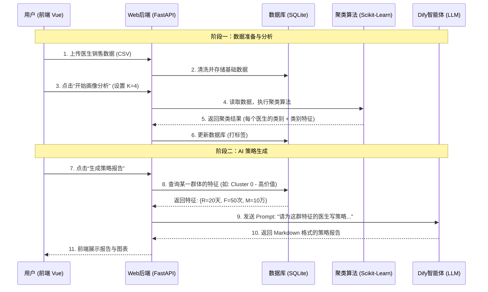

# 医药市场智能分析系统：技术架构与核心关系解析

本文档旨在阐明  **K-Means 聚类算法** 、**Dify 智能体** 与 **Web 业务系统** 三者在本项目中的定位、关系及数据流向。

## 1. 三大核心模块的关系定位

你可以把这个系统想象成一家 **“智能咨询公司”**：

1. **后端系统 (Web System)** 是  **“公司经理”** 。
   * 他负责接待客户（用户登录），接收客户的原始资料（上传数据），协调各部门工作，最后把结果通过漂亮的PPT（前端界面）展示给客户。
2. **K-Means 算法模块** 是  **“数据分析师”** 。
   * 他不怎么会说话，但擅长数学。经理把成千上万条杂乱的医生数据扔给他，他负责把这些医生分成几类（Cluster），并告诉经理每一类有什么特点（比如“这一类人很有钱但最近没来消费”）。
3. **Dify 智能体** 是  **“资深策划顾问”** 。
   * 他文笔好，懂营销策略。经理把分析师（K-Means）算出来的**“每一类人的特点”**发给他，他负责写出一份详细的《市场营销策略报告》。

## 2. 核心业务数据流向图 (Data Flow)

整个系统的运行流程，就是数据在三个模块间流转的过程：

## 3. 详细交互逻辑

### 3.1 K-Means 与 系统的关系

* **嵌入方式** ：K-Means 代码是直接写在后端 (`analysis_service.py`) 里的，它是系统内部的一个函数库。
* **输入** ：从数据库 `doctors` 表里查出来的 RFM 数值。
* **输出** ：

1. 给每个医生打上的标签 ID (0, 1, 2...)，存回 `doctors` 表。
2. 计算出的每个群体的**中心点统计数据** (如平均消费金额)，存入 `cluster_results` 表。**注意：这才是给 Dify 看的东西。**

### 3.2 Dify 与 系统的关系

* **调用方式** ：Dify 是外部独立的 AI 平台。系统通过 **HTTP API** (就像访问百度一样) 去调用它。
* **为什么需要 Dify？** ：
* K-Means 只能告诉你“这群人平均消费 1万”，它是 **数字** 。
* Dify 能根据这个数字，告诉你“这是一群高价值客户，建议派资深代表拜访，邀请参加高端学术会议”，这是 **策略** 。
* **关键连接点** ：系统的后端负责把 K-Means 算出来的 **数字特征** ，拼装成一段话（Prompt），发给 Dify。

## 4. 你的毕设亮点在哪里？

1. **数据驱动 (K-Means)** ：不是拍脑袋做决策，而是基于真实数据挖掘出的客观规律。
2. **AI 赋能 (Dify)** ：利用大模型把冰冷的数据变成了可执行的商业策略，这是当前最火的 "Agent" 概念。
3. **系统闭环** ：从数据上传 -> 分析 -> 决策，形成了一个完整的自动化工作流。

## 5. 总结

* **K-Means** 负责把数据  **“分好类”** 。
* **Dify** 负责对着分类结果  **“出主意”** 。
* **系统** 负责把它们 **“连起来”** 给用户用。

用户上传医生数据 → 后端清洗存储 → 用户触发聚类分析
→ K-Means 计算 RFM 特征并分群 → 存储聚类结果
→ 用户请求策略报告 → 后端构造 Prompt 发给 Dify
→ Dify 返回 Markdown 策略报告 → 前端展示
